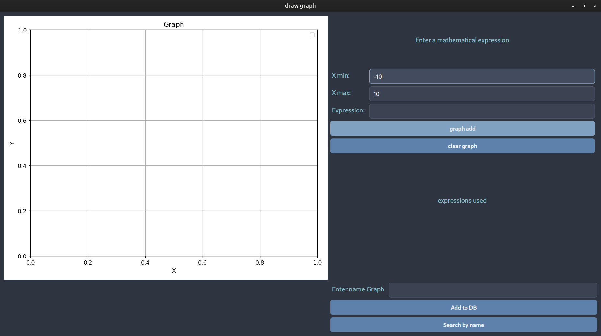
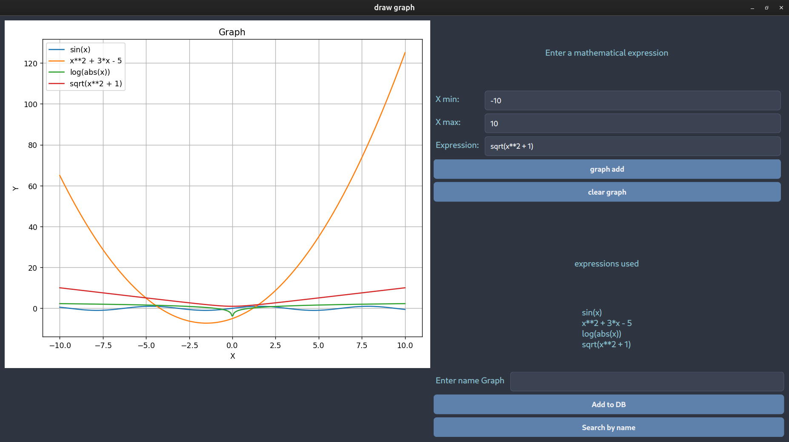

# 🧮 Graph Drawer App

A desktop application for drawing and saving graphs of mathematical expressions in Python using PyQt6, Matplotlib and SQLAlchemy.

## 📌 Features

- Plotting mathematical expressions (e.g. `sin(x)`, `x**2 + 3`)
- Support for expressions with NumPy functions (`log`, `sqrt`, `abs`, etc.).
- Input of `x_min`, `x_max` range of values
- Saving the chart to SQLite database
- Loading and re-displaying charts by name
- Resetting and clearing charts
- Safe expression processing (limited eval)

## 🛠️ Technologies used

- PyQt6
- Matplotlib
- SQLAlchemy + SQLite
- NumPy

## 📷 Screenshots

### Main window


### Example graph


## 🧱 Architecture

- `main.py` is the entry point
- `main_window.py` - UI and event handling
- `service.py` / `service_abc.py` - graphing logic
- `graph_repository.py` - database interaction
- `model.py` / `get_db.py` - SQLAlchemy ORM
- `style.py` - interface styling

## 🚀 How to run

1. Install dependencies:
    ```bash
    pip install -r requirements.txt
    ```

2. Run the application:
    ````bash
    python main.py
    ```

## 🧩 Example expressions

- `sin(x)`
- `x**2 + 3*x - 5`
- `log(abs(x))`
- `sqrt(x**2 + 1)`

## 📂 Project structure

````
├── app
│   ├── db
│   │   ├── get_db.py
│   │   ├── model.py
│   ├── gui
│   │   ├── main_window.py
│   │   └── style
│   │       └── style.py
│   └── service
│       ├── DRY.py
│       ├── graph_repository.py
│       ├── service_abc.py
│       └── service.py
├── main.py
├── README.md
└── requirements.txt
````